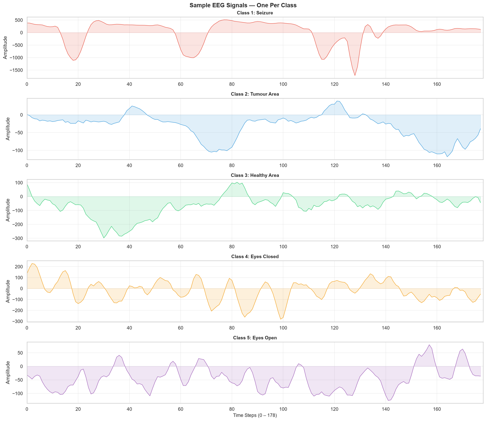
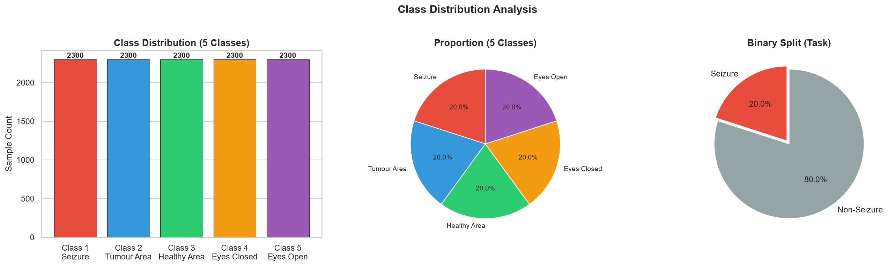
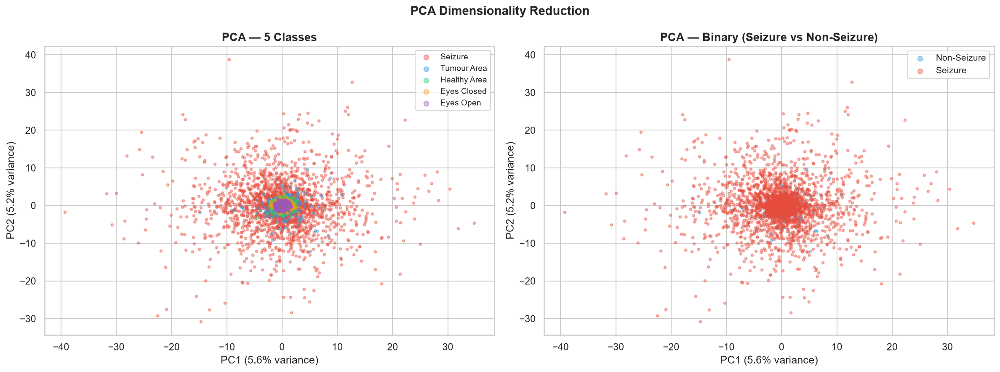
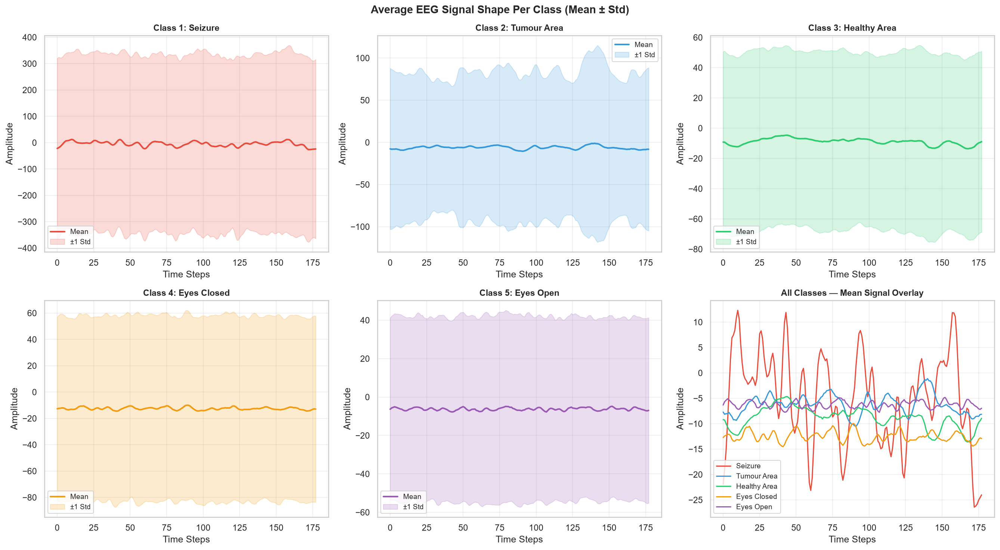
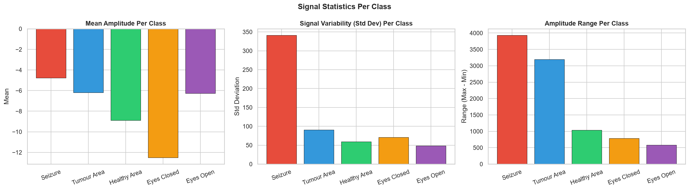
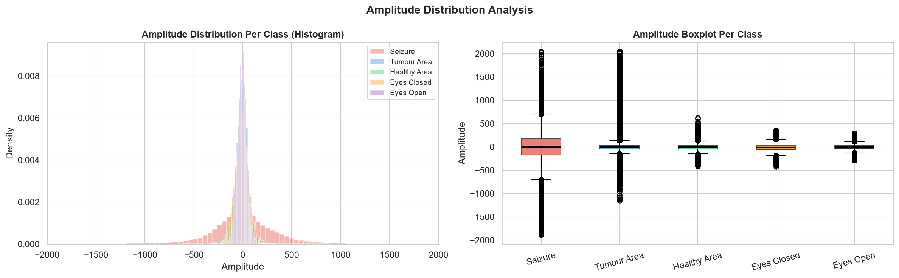

# Epileptic Seizure Detection Using Deep Learning

A deep learning project for EEG-based epileptic seizure detection using 1D Convolutional Neural Networks, LSTM, and a CNN-LSTM Hybrid model.

## Project Goals
- Achieve **92% classification accuracy**
- Reduce false alarms by **30%**
- Compare multiple deep learning architectures
- Evaluate using Confusion Matrix and ROC Curve

## Dataset
[Epileptic Seizure Recognition — Kaggle](https://www.kaggle.com/datasets/harunshimanto/epileptic-seizure-recognition)
- **11,500** EEG samples (perfectly balanced — 2,300 per class)
- **178** time-series features per sample (EEG time steps)
- **5 classes** → converted to binary: Class 1 = seizure, Classes 2–5 = non-seizure

| Class | Label | Description |
|---|---|---|
| 1 | Seizure | Epileptic seizure activity |
| 2 | Non-Seizure | EEG recorded from tumour area |
| 3 | Non-Seizure | EEG recorded from healthy brain area |
| 4 | Non-Seizure | Eyes closed |
| 5 | Non-Seizure | Eyes open |

## Model Architectures

### 1. 1D CNN
```
Input (178, 1)
→ Conv1D(64, k=5) → BatchNorm → MaxPool → Dropout(0.3)
→ Conv1D(128, k=5) → BatchNorm → MaxPool → Dropout(0.3)
→ Conv1D(256, k=3) → BatchNorm → MaxPool → Dropout(0.3)
→ Flatten → Dense(128) → Dropout(0.5)
→ Dense(64) → Dropout(0.3) → Dense(1, sigmoid)
```

### 2. LSTM
```
Input (178, 1)
→ LSTM(128, return_sequences=True) → Dropout(0.3)
→ LSTM(64) → Dropout(0.3)
→ Dense(64) → Dropout(0.3) → Dense(1, sigmoid)
```

### 3. CNN-LSTM Hybrid
```
Input (178, 1)
→ Conv1D(64, k=5) → BatchNorm → MaxPool → Dropout(0.3)
→ Conv1D(128, k=3) → BatchNorm → MaxPool → Dropout(0.3)
→ LSTM(128, return_sequences=True) → Dropout(0.3)
→ LSTM(64) → Dropout(0.3)
→ Dense(64) → Dropout(0.3) → Dense(1, sigmoid)
```

**Loss:** Binary Crossentropy | **Optimizer:** Adam | **Callbacks:** EarlyStopping, ReduceLROnPlateau, ModelCheckpoint

## Project Structure
```
Epileptic_Seizure_Detection/
├── data/                           ← place dataset CSV here (not tracked)
├── eda.ipynb                       ← detailed exploratory data analysis
├── seizure_detection.ipynb         ← model training & evaluation
├── model/
│   └── seizure_model.h5            ← best saved model
├── outputs/
│   ├── class_distribution.png
│   ├── eda_eeg_signals.png
│   ├── eda_pca.png
│   ├── training_curves.png
│   ├── model_comparison.png
│   ├── confusion_matrix.png
│   └── roc_curve.png
└── requirements.txt
```

## EDA Highlights

| EEG Signals Per Class | Class Distribution |
|---|---|
|  |  |

| PCA Visualization | Average Signal Shape Per Class |
|---|---|
|  |  |

| Signal Statistics | Amplitude Distribution |
|---|---|
|  |  |

## Setup & Run
```bash
# Create virtual environment
python -m venv venv
venv\Scripts\activate          # Windows
source venv/bin/activate       # Mac/Linux

# Install dependencies
pip install -r requirements.txt

# Run EDA first
jupyter notebook eda.ipynb

# Then run model training
jupyter notebook seizure_detection.ipynb
```

## Tech Stack
`Python` `TensorFlow/Keras` `NumPy` `Pandas` `scikit-learn` `Matplotlib` `Seaborn` `SciPy`

## Author
**Sandhya Singh**
