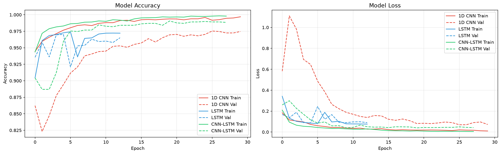
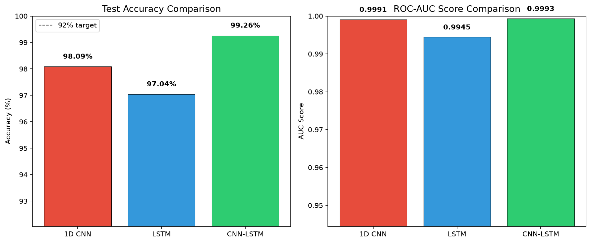
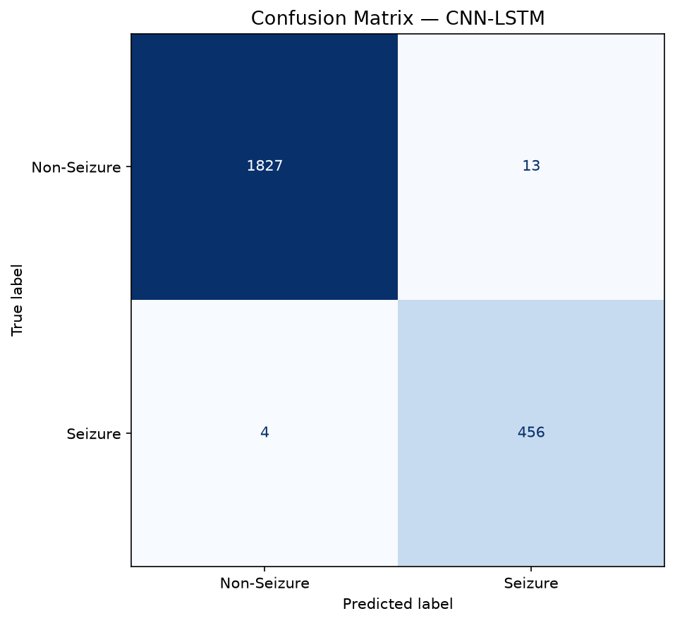
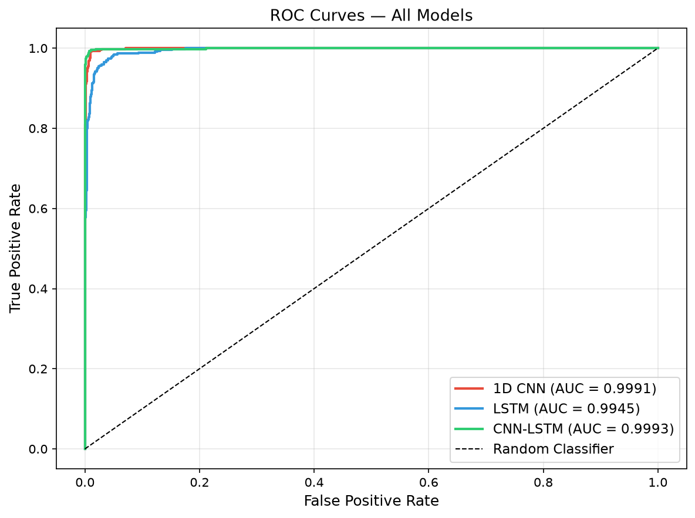

# Epileptic Seizure Detection Using Deep Learning

[](https://epileptic-seizure-detection.streamlit.app/)

A deep learning project for EEG-based epileptic seizure detection using 1D Convolutional Neural Networks, LSTM, and a CNN-LSTM Hybrid model.

**Live Demo:** https://epileptic-seizure-detection.streamlit.app/

## Project Goals
- Achieve **92% classification accuracy**
- Reduce false alarms by **30%**
- Compare multiple deep learning architectures
- Evaluate using Confusion Matrix and ROC Curve

## Dataset
[Epileptic Seizure Recognition — Kaggle](https://www.kaggle.com/datasets/harunshimanto/epileptic-seizure-recognition)
- **11,500** EEG samples (perfectly balanced — 2,300 per class)
- **178** time-series features per sample (EEG time steps)
- **5 classes** → converted to binary: Class 1 = seizure, Classes 2–5 = non-seizure

| Class | Label | Description |
|---|---|---|
| 1 | Seizure | Epileptic seizure activity |
| 2 | Non-Seizure | EEG recorded from tumour area |
| 3 | Non-Seizure | EEG recorded from healthy brain area |
| 4 | Non-Seizure | Eyes closed |
| 5 | Non-Seizure | Eyes open |

## Model Architectures

### 1. 1D CNN
```
Input (178, 1)
→ Conv1D(64, k=5) → BatchNorm → MaxPool → Dropout(0.3)
→ Conv1D(128, k=5) → BatchNorm → MaxPool → Dropout(0.3)
→ Conv1D(256, k=3) → BatchNorm → MaxPool → Dropout(0.3)
→ Flatten → Dense(128) → Dropout(0.5)
→ Dense(64) → Dropout(0.3) → Dense(1, sigmoid)
```

### 2. LSTM
```
Input (178, 1)
→ LSTM(128, return_sequences=True) → Dropout(0.3)
→ LSTM(64) → Dropout(0.3)
→ Dense(64) → Dropout(0.3) → Dense(1, sigmoid)
```

### 3. CNN-LSTM Hybrid
```
Input (178, 1)
→ Conv1D(64, k=5) → BatchNorm → MaxPool → Dropout(0.3)
→ Conv1D(128, k=3) → BatchNorm → MaxPool → Dropout(0.3)
→ LSTM(128, return_sequences=True) → Dropout(0.3)
→ LSTM(64) → Dropout(0.3)
→ Dense(64) → Dropout(0.3) → Dense(1, sigmoid)
```

**Loss:** Binary Crossentropy | **Optimizer:** Adam | **Callbacks:** EarlyStopping, ReduceLROnPlateau, ModelCheckpoint

## Project Structure
```
Epileptic_Seizure_Detection/
├── data/                           ← place dataset CSV here (not tracked)
├── eda.ipynb                       ← detailed exploratory data analysis
├── seizure_detection.ipynb         ← model training & evaluation
├── model/
│   └── seizure_model.h5            ← best saved model
├── outputs/
│   ├── class_distribution.png
│   ├── eda_eeg_signals.png
│   ├── eda_pca.png
│   ├── training_curves.png
│   ├── model_comparison.png
│   ├── confusion_matrix.png
│   └── roc_curve.png
└── requirements.txt
```

## Results

### Model Comparison

| Model | Test Accuracy | AUC | Epochs |
|---|---|---|---|
| 1D CNN | 98.09% | 0.9991 | 30 |
| LSTM | 97.04% | 0.9945 | 13 (early stop) |
| **CNN-LSTM Hybrid** | **99.26%** | **0.9993** | **28 (early stop)** |

### Best Model — CNN-LSTM Hybrid

| Metric | Non-Seizure | Seizure |
|---|---|---|
| Precision | 1.00 | 0.97 |
| Recall | 0.99 | 0.99 |
| F1-Score | 1.00 | 0.98 |

**Confusion Matrix (CNN-LSTM on 2,300 test samples):**
- ✅ True Positives (seizure correctly detected): **456 / 460**
- ✅ True Negatives (non-seizure correctly rejected): **1,827 / 1,840**
- ⚠️ False Alarms (FP): **13**
- ⚠️ Missed Seizures (FN): **4**

> Target was 92% accuracy — achieved **99.26%** ✅  
> Target was 30% reduction in false alarms — only **13 false alarms out of 1,840** non-seizure samples ✅

### Overfitting Analysis

| Model | Train Acc | Val Acc | Test Acc | Gap (Train - Test) |
|---|---|---|---|---|
| 1D CNN | 99.69% | 97.54% | 98.09% | 1.60% ✅ |
| LSTM | 97.21% | 97.03% | 97.04% | 0.17% ✅ |
| CNN-LSTM | 99.80% | 99.06% | 99.26% | 0.54% ✅ |

**No overfitting observed** — key reasons:
- Train vs Test accuracy gap is **< 2% across all models** — negligible
- `EarlyStopping` restored best weights before models could memorize training data
- `Dropout` layers (0.3–0.5) and `BatchNormalization` acted as strong regularizers
- Val accuracy and Test accuracy are nearly identical, confirming the model generalizes well to unseen data

### Training Curves & Evaluation Plots

| Training Curves | Model Comparison |
|---|---|
|  |  |

| Confusion Matrix | ROC Curve |
|---|---|
|  |  |

---

## EDA Highlights

| EEG Signals Per Class | Class Distribution |
|---|---|
|  |  |

| PCA Visualization | Average Signal Shape Per Class |
|---|---|
|  |  |

| Signal Statistics | Amplitude Distribution |
|---|---|
|  |  |

## Setup & Run
```bash
# Create virtual environment
python -m venv venv
venv\Scripts\activate          # Windows
source venv/bin/activate       # Mac/Linux

# Install dependencies
pip install -r requirements.txt

# Run EDA first
jupyter notebook eda.ipynb

# Then run model training
jupyter notebook seizure_detection.ipynb
```

## Tech Stack
`Python` `TensorFlow/Keras` `NumPy` `Pandas` `scikit-learn` `Matplotlib` `Seaborn` `SciPy`

## Author
**Sandhya Singh**
